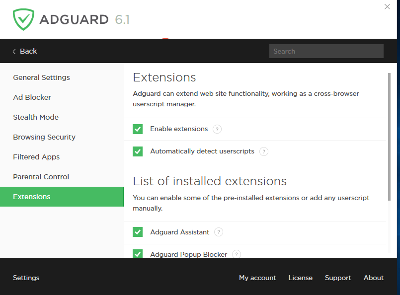
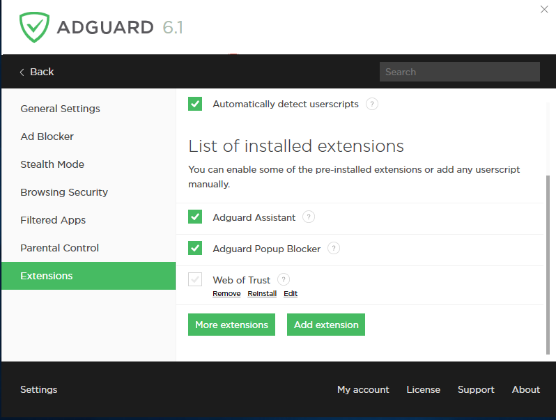

Adguard can significantly broaden website functionality working as a [user script manager](https://adguard.com/en/userscripts.html). Adguard Users can add their own scripts, as well as manage existing ones.

**Enable extensions**

Turn the extension support module on or off.

**Automatically detect userscripts**

With this option enabled, Adguard will automatically define browser queries to userscripts and suggest their installation. Otherwise, extensions can be downloaded and installed manually.

The following extensions are installed with Adguard:

** Adguard Assistant **

The name of this extension is quite deliberate: it actually assists the user in changing basic Adguard settings right in the browser, without the need to open the app itself. Adguard Assistant works with all Microsoft Windows compatible browsers. In addition, the Adguard Assistant icon will not be displayed on websites listed as exceptions by the user and on certain web pages where there is a risk of incorrect content display. You can find detailed description of capabilities and adjustment methods of Adguard Assistant in the relevant section of our Knowledge Database.

** Adguard Popup Blocker **

This extension prevents popup windows from opening when you view web pages. Some popups are considered useful – they may contain settings for site administering or additional reference information demonstrated upon clicking a link. That is why you can turn off the Blocker if needed. This extension doesn’t work on websites added to the Adguard exceptions list either. It is turned off by default, but you can turn it on in the application settings. You will find more detailed information about this extension in our Knowledge Database.

** Web of Trust **

Web of Trust lets you see the reputation of each website based on its users’ opinions. The site is rated by a number of specific criteria: trust, security, etc. This extension is turned off by default, but you can turn it on in the application settings. You will find more detailed information about this extension in our Knowledge Database.

