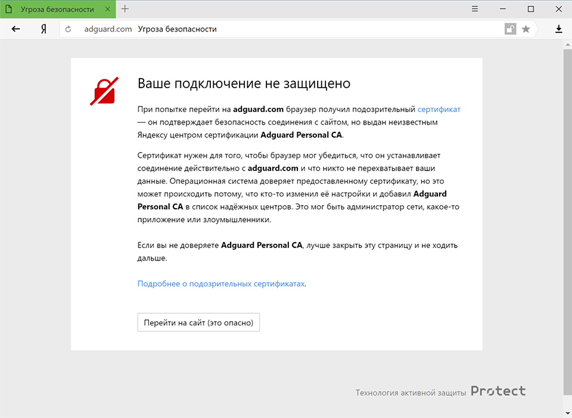

Если вы являетесь одновременно пользователем Adguard для Windows и Яндекс.Браузера, то вы могли столкнуться с таким предупреждением:

### Почему это происходит

Оно может выглядеть устрашающе, но на деле нет причин бросаться удалять Adguard или Яндекс. Объясним, почему.

И Adguard, и Яндекс очень серьезно подходят к вопросу HTTPS безопасности. Текущая политика Яндекса предписывает предупреждать пользователей о любом сертификате безопасности, не распознаваемом браузером. Это не всегда необосновано, так как иногда вредоносные программы могут вставлять свои сертификаты и наносить вред системе.

Однако, Adguard также добавляет свой сертификат в список доверенных, чтобы иметь возможность фильтровать весь трафик и эффективно блокировать рекламу. Это и приводит к появлению предупреждения.

### Что делать?

Самый простой способ - кикнуть по кнопку **"Перейти на сайт"**. Этим вы говорите Яндекс.Браузеру, что вы доверяете сертификату Adguard, и он запомнит его как доверенный. Обычно, после этого вы больше не столкнётесь с подобным предупреждением, однако изредка это может происходить по некоторым причинам. В таком случае просто нажмите эту же кнопку ещё раз.

Отключение фильтрации HTTPS в настройках Adguard также предотвратит появление данного предупреждения, но такой метод обойдётся дорогой ценой: вся реклама, загрудаемая по HTTPS, включая **собственную рекламу Яндекса**, будет отображаться. Мы не советуем выбирать этот путь, если вы хотите сохранить высокое качество блокировки рекламы.
